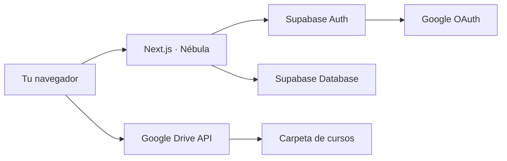
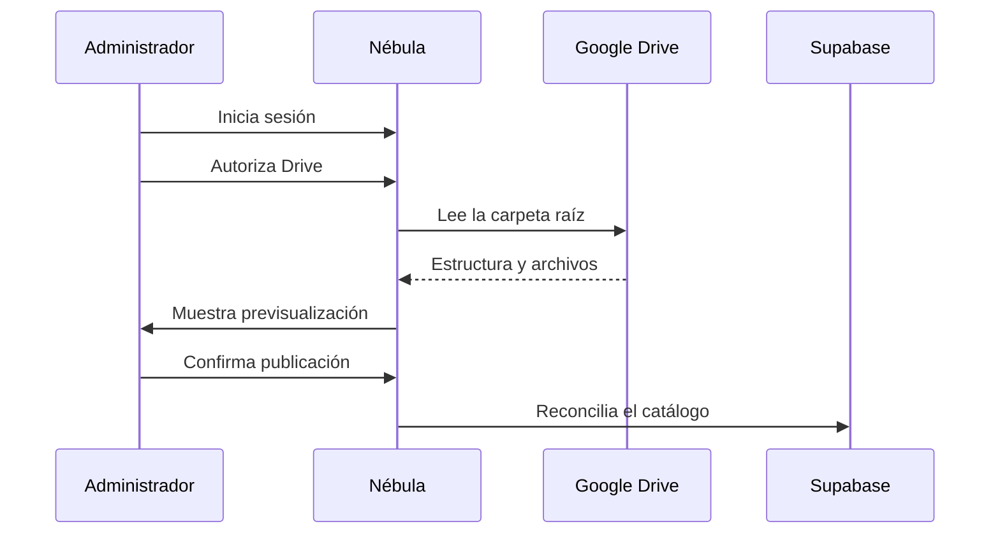

# Nébula · instalación completa

Guía práctica para dejar Nébula funcionando en otra computadora desde cero. El estado actual del repositorio incluye el módulo de **Cursos**, autenticación con Google, catálogo en Supabase y reproducción directa desde Google Drive.

> [!IMPORTANT]
> Este repositorio es público. Nunca escribas aquí credenciales, correos personales, IDs privados de Drive ni valores de `.env.local`.

## Mapa rápido



| Pieza | Función | Dónde está |
|---|---|---|
| Aplicación | Interfaz, catálogo, reproductor y administración | `web/src` |
| Base de datos | Tablas, permisos, progreso y sincronización | `web/supabase/migrations` |
| Configuración local | URLs y credenciales de cada computadora | `web/.env.local` — nunca se sube |
| Configuración de ejemplo | Lista segura de variables necesarias | `web/.env.local.example` |
| Pruebas | Validación de sincronización y catálogo | `web/test` |

## Recorrido completo

```text
1. Instalar herramientas
        ↓
2. Clonar el repositorio
        ↓
3. Crear o conectar Supabase
        ↓
4. Configurar Google OAuth + Drive API
        ↓
5. Crear web/.env.local
        ↓
6. Iniciar sesión y nombrar al administrador
        ↓
7. Sincronizar la biblioteca
        ↓
8. Ejecutar pruebas y usar Nébula
```

## 1 · Preparar la computadora

Necesitas:

- [Git](https://git-scm.com/downloads).
- [Node.js](https://nodejs.org/en/download) `20.9` o posterior. Conviene usar una versión LTS compatible.
- Una cuenta de [Supabase](https://supabase.com/dashboard).
- Una cuenta de Google con acceso al proyecto OAuth y a la carpeta de Drive.
- Al menos un navegador Chromium actualizado para la primera validación.

Comprueba Git, Node y npm:

```powershell
git --version
node --version
npm --version
```

Node debe mostrar `v20.9.0` o una versión superior.

## 2 · Descargar Nébula

### Windows · PowerShell

```powershell
git clone https://github.com/terbayte0310/ProyectoStreamingDrive.git
Set-Location ProyectoStreamingDrive\web
npm ci
```

### macOS o Linux

```bash
git clone https://github.com/terbayte0310/ProyectoStreamingDrive.git
cd ProyectoStreamingDrive/web
npm ci
```

`npm ci` instala exactamente las versiones guardadas en `package-lock.json`. No copies `node_modules` desde otra computadora.

## 3 · Preparar Supabase

Puedes conectar un proyecto Supabase existente o crear uno nuevo en el panel. Conserva temporalmente estos datos en un gestor seguro:

- **Project ref**: aparece en la URL `https://supabase.com/dashboard/project/TU_PROJECT_REF`.
- **Project URL**: tiene la forma `https://TU_PROJECT_REF.supabase.co`.
- **Publishable key**: clave pública usada por el navegador.
- Contraseña de base de datos: solo para enlazar herramientas; no va en `.env.local`.

### Aplicar todas las migraciones

Desde la carpeta `web`, ejecuta:

```powershell
npx supabase@latest init
npx supabase@latest login
npx supabase@latest link --project-ref TU_PROJECT_REF
npx supabase@latest db push --dry-run
npx supabase@latest db push
npx supabase@latest migration list
```

Notas:

- Si `init` indica que el proyecto ya estaba inicializado, continúa con `login`.
- Revisa el resultado de `--dry-run` antes de aplicar nada.
- `db push` aplica las migraciones pendientes en orden; no elimina la biblioteca.
- Nunca ejecutes `supabase db reset --linked` contra el proyecto real: esa orden borra la base remota.

Al terminar, `migration list` debe mostrar las migraciones locales y remotas alineadas.

## 4 · Configurar Google OAuth y Drive

Nébula utiliza un mismo cliente OAuth para iniciar sesión y solicitar acceso de solo lectura a Drive.

### 4.1 Google Cloud

En [Google Cloud Console](https://console.cloud.google.com/):

1. Crea o selecciona un proyecto exclusivo para Nébula.
2. Abre **APIs y servicios** y habilita **Google Drive API**.
3. Abre **Google Auth Platform**.
4. En **Branding**, completa solo los datos básicos de Nébula.
5. En **Audience**, selecciona audiencia externa y añade como usuarios de prueba únicamente las cuentas autorizadas.
6. En **Data Access**, añade:
   - `openid`
   - `userinfo.email`
   - `userinfo.profile`
   - `https://www.googleapis.com/auth/drive.readonly`
7. En **Clients**, crea un cliente de tipo **Web application**.
8. En **Authorized JavaScript origins**, añade:

```text
http://localhost:3000
```

9. En **Authorized redirect URIs**, añade el callback que muestra Supabase:

```text
https://TU_PROJECT_REF.supabase.co/auth/v1/callback
```

Guarda el **Client ID** y el **Client Secret**. No los pegues en el README, en un commit ni en una conversación.

### 4.2 Supabase Auth

En Supabase:

1. Abre **Authentication → Providers → Google**.
2. Activa Google.
3. Pega el mismo Client ID y Client Secret del paso anterior.
4. Abre **Authentication → URL Configuration**.
5. Usa como **Site URL**:

```text
http://localhost:3000
```

6. Añade a **Redirect URLs**:

```text
http://localhost:3000/**
```

### 4.3 Carpeta de Google Drive

La carpeta raíz debe contener la biblioteca completa de cursos. Su ID es la parte situada después de `/folders/`:

```text
https://drive.google.com/drive/folders/ID_DE_LA_CARPETA
                                      └────────────────┘
```

Comparte esa carpeta como **Lector** con cada cuenta que usará Nébula. El permiso de la aplicación y el permiso de Drive son independientes: ambos tienen que existir.

## 5 · Crear la configuración local

Desde `web`, crea una copia privada del ejemplo.

### Windows · PowerShell

```powershell
Copy-Item .env.local.example .env.local
notepad .env.local
```

### macOS o Linux

```bash
cp .env.local.example .env.local
```

Completa únicamente tu copia local:

```dotenv
NEXT_PUBLIC_SUPABASE_URL=https://TU_PROJECT_REF.supabase.co
NEXT_PUBLIC_SUPABASE_PUBLISHABLE_KEY=TU_PUBLISHABLE_KEY

GOOGLE_DRIVE_CLIENT_ID=TU_CLIENT_ID
GOOGLE_DRIVE_CLIENT_SECRET=TU_CLIENT_SECRET
GOOGLE_DRIVE_ROOT_FOLDER_ID=ID_DE_LA_CARPETA_RAIZ
```

### Qué puede y qué no puede compartirse

| Variable | ¿Es secreta? | Regla |
|---|---:|---|
| `NEXT_PUBLIC_SUPABASE_URL` | No | Puede usarla el navegador |
| `NEXT_PUBLIC_SUPABASE_PUBLISHABLE_KEY` | No | Puede usarla el navegador; RLS protege los datos |
| `GOOGLE_DRIVE_CLIENT_ID` | Identificador | No publicarlo innecesariamente |
| `GOOGLE_DRIVE_CLIENT_SECRET` | **Sí** | Solo en `.env.local` y en Supabase |
| `GOOGLE_DRIVE_ROOT_FOLDER_ID` | Privado | Solo en `.env.local` |

> [!CAUTION]
> No uses una clave `service_role`, una contraseña de PostgreSQL ni un token de Drive en este archivo. Nébula no los necesita.

## 6 · Primer arranque

Inicia el servidor de desarrollo:

```powershell
npm run dev
```

Abre [http://localhost:3000](http://localhost:3000).

La primera cuenta que inicia sesión aparece en `public.profiles` como lector no autorizado. Esta separación evita que cualquier cuenta Google entre automáticamente.

### Convertir tu cuenta en administradora

Después del primer inicio de sesión:

1. Abre **Supabase → SQL Editor**.
2. Ejecuta lo siguiente reemplazando únicamente el marcador:

```sql
update public.profiles
set role = 'admin', is_authorized = true
where email = 'TU_CORREO_GOOGLE';
```

3. Cierra sesión en Nébula y vuelve a entrar.
4. Debe aparecer el acceso **Administrar catálogo**.

Para autorizar después a otra persona que ya intentó iniciar sesión:

```sql
update public.profiles
set role = 'reader', is_authorized = true
where email = 'CORREO_AUTORIZADO';
```

## 7 · Autorizar Drive y sincronizar



1. Entra con la cuenta administradora.
2. Abre un curso o el panel de administración y pulsa la opción para autorizar Drive.
3. Selecciona la misma cuenta que tiene acceso a la carpeta raíz.
4. Abre **Administrar catálogo**.
5. Ejecuta primero **Previsualizar**.
6. Revisa categorías, cursos, lecciones, archivos no compatibles y conflictos.
7. Publica únicamente si la raíz y los conteos son los esperados.
8. Repite una previsualización: no deben aparecer duplicados.

Nébula solo lee Drive. La sincronización no mueve, renombra ni elimina archivos.

## 8 · Validación antes de usarla

Detén el servidor con `Ctrl+C` y ejecuta:

```powershell
npm test
npm run lint
npm run build
```

Las tres órdenes deben terminar correctamente. Después puedes ejecutar el build de producción local:

```powershell
npm run start
```

Abre de nuevo [http://localhost:3000](http://localhost:3000) y valida:

- [ ] Inicio y cierre de sesión.
- [ ] Acceso al catálogo.
- [ ] Autorización de Drive.
- [ ] Reproducción y avance del vídeo.
- [ ] Guardado del progreso.
- [ ] Notas de una lección.
- [ ] Panel de administración.
- [ ] Previsualización de sincronización sin duplicados.

## Llevar la instalación a otra computadora

En el equipo nuevo:

1. Instala Git y Node.
2. Clona el repositorio.
3. Ejecuta `npm ci` dentro de `web`.
4. Crea un **nuevo** `web/.env.local` con los mismos cinco valores guardados de forma segura.
5. No vuelvas a crear Supabase ni a aplicar las migraciones si usarás el mismo proyecto y `migration list` ya está alineado.
6. Confirma que `http://localhost:3000/**` continúa permitido en Supabase.
7. Ejecuta `npm run dev` o `npm run build` seguido de `npm run start`.

No debes copiar estas carpetas:

```text
node_modules/
web/.next/
web/node_modules/
```

Tampoco debes transportar `.env.local` por correo o Git. Usa un gestor de contraseñas o copia local cifrada.

## Actualizar una instalación existente

Guarda primero cualquier cambio propio. Después:

```powershell
git pull --ff-only
Set-Location web
npm ci
npx supabase@latest db push --dry-run
npx supabase@latest db push
npm test
npm run lint
npm run build
```

Reinicia `npm run dev` o `npm run start` después de actualizar.

## Problemas comunes

| Síntoma | Revisión rápida |
|---|---|
| “La configuración local está incompleta” | Comprueba las cinco variables de `web/.env.local` y reinicia Next.js |
| Google devuelve `redirect_uri_mismatch` | El callback de Supabase debe coincidir exactamente en Google Cloud |
| La cuenta inicia sesión pero está bloqueada | Autoriza su fila en `public.profiles` |
| Nébula solicita Drive repetidamente | Confirma `drive.readonly`, el Client ID/Secret común y la audiencia OAuth |
| El catálogo está vacío | Revisa el ID de la carpeta raíz y ejecuta Previsualizar antes de Publicar |
| El vídeo queda en `0:00` | Recarga normalmente; una recarga forzada puede saltarse temporalmente el Service Worker |
| Drive responde `403` | Confirma que esa cuenta tiene permiso de Lector sobre la carpeta y sus archivos |
| El token deja de funcionar a los siete días | El proyecto OAuth está en Testing; vuelve a autorizar o revisa su estado de publicación |
| `npm run build` rechaza Node | Instala Node `20.9` o posterior y vuelve a ejecutar `npm ci` |

## Regla de seguridad para Git

Antes de cualquier commit:

```powershell
git status --short
git diff --check
git check-ignore -v web/.env.local
```

La última orden debe confirmar que `.env.local` está ignorado. Si aparece como archivo para subir, detente y corrige `.gitignore` antes de continuar.

## Comandos esenciales

| Objetivo | Comando desde `web` |
|---|---|
| Instalar dependencias | `npm ci` |
| Desarrollo | `npm run dev` |
| Pruebas | `npm test` |
| Revisar estilo/código | `npm run lint` |
| Construir producción | `npm run build` |
| Ejecutar producción local | `npm run start` |
| Ver migraciones | `npx supabase@latest migration list` |
| Previsualizar migraciones | `npx supabase@latest db push --dry-run` |
| Aplicar migraciones | `npx supabase@latest db push` |

Con estos pasos, el código viaja por Git; la base permanece en Supabase; los vídeos permanecen en Drive; y los secretos solo existen en la configuración privada de cada computadora.
