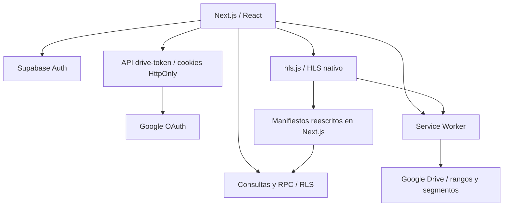

# 01 · Alcance y arquitectura

## Alcance real

Se inventariaron rutas, componentes, utilidades, pruebas y migraciones; se leyeron los flujos principales de acceso, catálogo, reproducción, administración HLS, cookies, worker, progreso y notas. No equivale a examinar cada línea del repositorio ni a una prueba de penetración. Combina evidencia estática y pruebas locales de interacción. No hubo sesión autenticada de Google/Supabase para validar contenido privado.

| Área | Evidencia inspeccionada | Observación |
| --- | --- | --- |
| Acceso | `src/lib/auth/access.ts`, signin, dashboard | Sesión y autorización separadas |
| Módulos | RPC y migración `20260913020000_module_access_rls.sql` | Cursos, películas y series con acceso separado |
| Catálogo | `src/app/catalog/**`, `components/media-catalog.tsx` | Metadatos TMDB cacheados y publicaciones |
| Cursos | `course-player-content.tsx`, `lib/catalog/outline.ts` | Cola, progreso, notas y recursos |
| HLS | `media-hls-player.tsx`, `lib/media/hls.ts`, `api/media-hls` | Referencias a identificadores de activos |
| Transporte | `public/sw.js`, `api/drive-token`, `lib/drive/session.ts` | Acceso directo a Drive y renovación |
| Administración | `api/admin/media`, `api/admin/media-playback`, gestores | Rol y publicación en varias escrituras |
| Sincronización | `durable-sync.ts`, `library-snapshot.ts`, pruebas | Preparación por carpetas y orden/aislamiento |
| Presupuesto | `lib/transfer-budget.ts`, worker, pruebas | Reserva previa y bloqueo de emergencia |
| Dependencias | package, lock y npm audit | Sin nuevas dependencias |

## Límites

No se comprobó estado remoto de migraciones, configuración OAuth, cuotas de Drive, RLS desplegada, codecs concretos ni películas reales. Se usó Edge Chromium aislado. La navegación integrada falló al iniciar; Playwright del entorno permitió completar la revisión local.

No se imprimieron ni copiaron valores de `.env.local`. Su existencia se observa en el build, pero no se usaron sus secretos para acceder a servicios manualmente.
