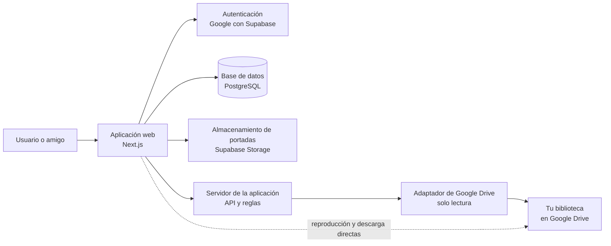

# Arquitectura técnica propuesta

## Recomendación

Construir el MVP como una aplicación web con **Next.js y TypeScript**, usando **Supabase** para autenticación, base de datos PostgreSQL y almacenamiento de portadas.

Esta elección concentra la interfaz y el servidor de la aplicación en un solo proyecto, reduce la infraestructura que hay que administrar y utiliza tecnologías que también aparecen en tu inventario de aprendizaje: React, Next y TypeScript.

No usaremos Supabase como almacenamiento de videos. Google Drive seguirá siendo el único almacén de cursos y videos.

## Componentes y responsabilidades



| Componente | Responsabilidad | No hace |
| --- | --- | --- |
| Aplicación web | Pantallas, reproducción, búsqueda, notas y panel administrativo. | No guarda videos. |
| Servidor de la aplicación | Aplica roles, sincroniza el catálogo, guarda progreso y protege secretos. | No transmite videos como proxy. |
| Supabase Auth | Inicio de sesión con Google y sesión del usuario. | No concede acceso a tus archivos de Drive. |
| PostgreSQL | Usuarios, catálogo, progreso, notas, orden, portadas y auditoría. | No es una copia de los videos. |
| Supabase Storage | Portadas personalizadas y fotogramas generados. | No almacena cursos. |
| Google Drive | Directorios, videos, subtítulos y recursos originales. | No guarda progreso ni notas de la app. |

## Dos conexiones distintas con Google

Es esencial no confundirlas.

### 1. Inicio de sesión de cada usuario

Todos, incluidos tus amigos, usarán Google solo para demostrar quiénes son. La aplicación recibirá su identidad y comprobará si está en la lista de correos autorizados.

Permisos solicitados: identidad básica (`openid`, correo y perfil). No se pide acceso al Drive personal de tus amigos.

### 2. Conexión de la biblioteca del propietario

Solo tú, como propietario, autorizarás al servidor para leer la carpeta raíz de tu biblioteca. Esa autorización permite detectar directorios y archivos durante una sincronización.

Permiso esperado: acceso de solo lectura a Drive, limitado al uso necesario para leer la biblioteca configurada. El token de actualización se almacenará cifrado, únicamente en el servidor, y nunca se enviará al navegador.

El permiso de lectura amplia de Drive es clasificado por Google como restringido. Antes de construir la integración definitiva, validaremos el flujo con una prueba técnica y revisaremos los requisitos de consentimiento o verificación que apliquen a una aplicación usada por amigos.

## Acceso de amigos a videos

1. Compartes manualmente la carpeta raíz de Drive con cada correo autorizado, con rol de lector.
2. La aplicación muestra el catálogo a esas mismas personas.
3. Al reproducir o descargar, el navegador accede directamente al archivo de Drive.
4. Drive evalúa los permisos del usuario antes de entregar el contenido.

El servidor nunca debe entregar a un amigo un token que tenga acceso a tu Drive, ni copiar el video para reproducirlo. Esto reduce exposición de credenciales, coste de transferencia y complejidad.

## Seguridad y permisos

### Base de datos

Las reglas de seguridad a nivel de fila harán que:

- Un lector solo pueda consultar y modificar su propio progreso, notas y preferencias.
- Un lector pueda leer el catálogo publicado, pero no cambiarlo.
- Solo el administrador pueda cambiar usuarios autorizados, catálogo, orden, portadas y sincronizaciones.
- Las operaciones de sincronización y los secretos de Google solo existan en el servidor.

### Secretos

- Las claves de Google, Supabase y Drive no se guardarán en el repositorio ni en el navegador.
- Se configurarán como variables secretas del entorno de desarrollo y despliegue.
- El administrador seguirá siendo una autorización de la aplicación, independiente de la propiedad de Drive.

## Sincronización del catálogo

La sincronización será una tarea del servidor, iniciada manualmente por el administrador en el MVP. Más adelante puede programarse diariamente.

```text
Administrador solicita sincronización
→ servidor lee la carpeta raíz de Drive con tu autorización
→ normaliza directorios, archivos y orden
→ actualiza datos detectados sin reemplazar personalizaciones
→ reconstruye la secuencia de lecciones
→ registra resultado, errores y fecha
→ panel administrativo muestra el estado
```

## Prueba técnica obligatoria antes de construir el MVP

Esta prueba corta, también llamada *spike*, busca responder una incertidumbre real antes de invertir en toda la aplicación.

| Pregunta | Prueba | Resultado que necesitamos |
| --- | --- | --- |
| ¿Un amigo puede reproducir un video compartido desde la interfaz elegida? | Compartir una carpeta de prueba con una cuenta amiga y abrir un video desde un prototipo mínimo. | Video reproducible sin exponer el token del propietario. |
| ¿El servidor puede leer de forma continua la carpeta raíz? | Conectar solo tu cuenta, guardar el permiso de forma segura y listar una carpeta de prueba. | Sincronización de metadatos estable. |
| ¿La descarga respeta los permisos? | Probar una lección descargable y otra con descarga restringida. | El botón refleja correctamente el permiso de Drive. |
| ¿Podemos generar una portada desde un video? | Descargar temporalmente una pequeña muestra autorizada, extraer un fotograma y guardar solo la imagen. | Portada creada sin modificar Drive. |

Si alguna prueba falla, cambiaremos exclusivamente el componente afectado antes de comenzar la construcción del MVP.

## Decisiones técnicas aún abiertas

- Servicio exacto de despliegue de Next.js y ejecución de tareas programadas.
- Mecanismo de reproducción de Drive que supere la prueba técnica.
- Estrategia definitiva para el consentimiento de Google y la custodia del token del propietario.
- Formatos iniciales soportados para video, subtítulos y recursos.
